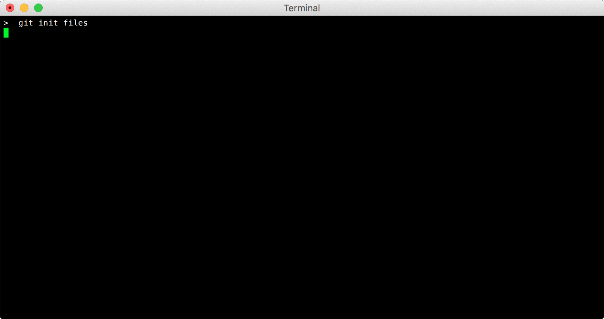

### Installation

```shell
gem install filecamo
```

### Generating Files

Filecamo can generate any number of binary or text files, automatically generating a deep directory
tree of random content and size. This is an excellent way to establish a corpus of files to use when
testing various upload or download services.

### Changing Files

Filecamo can intelligently insert new lines into text files, complete with prefixing the lines with
language-aware comment prefixes. This is an excellent way to conditionally modify some sets of files
when testing various change management or source control systems.

Currently, the following is a list of content languages Filecamo will detect:

* Ruby
* Python
* Javascript
* C#
* Shell
* HTML
